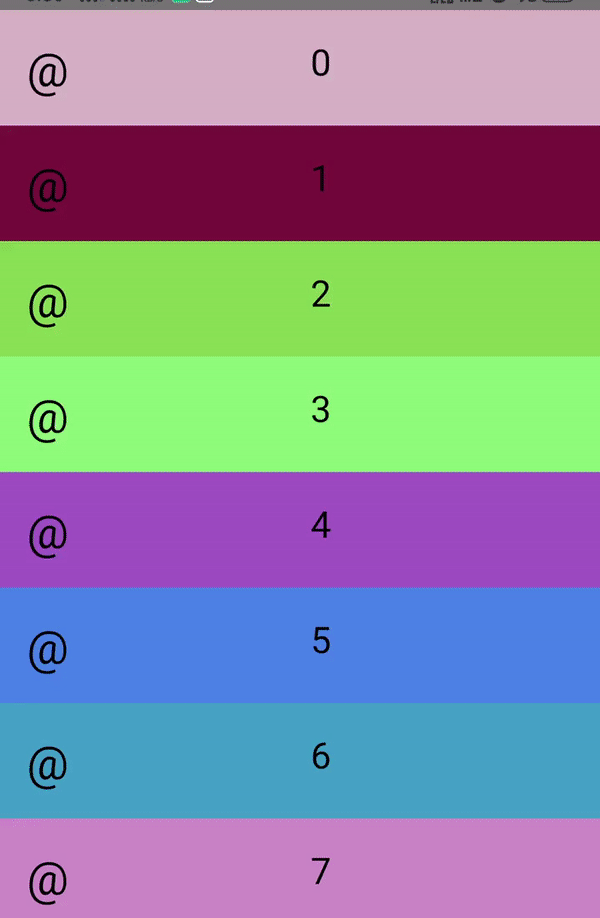

## Description

<h1>react-native-swipe-gestures</h1> 

React Native component for handling swipe gestures in up, down, left and right direction. 
Also Handling Drag and Drop of component using Pan Responder.

<h1>Try it out!</h1> 

<h3><b>Install dependencies:</b><h3> 
$ npm install or yarn

<h3><b>Run App:</b><h3> 
$ npm start or yarn start

